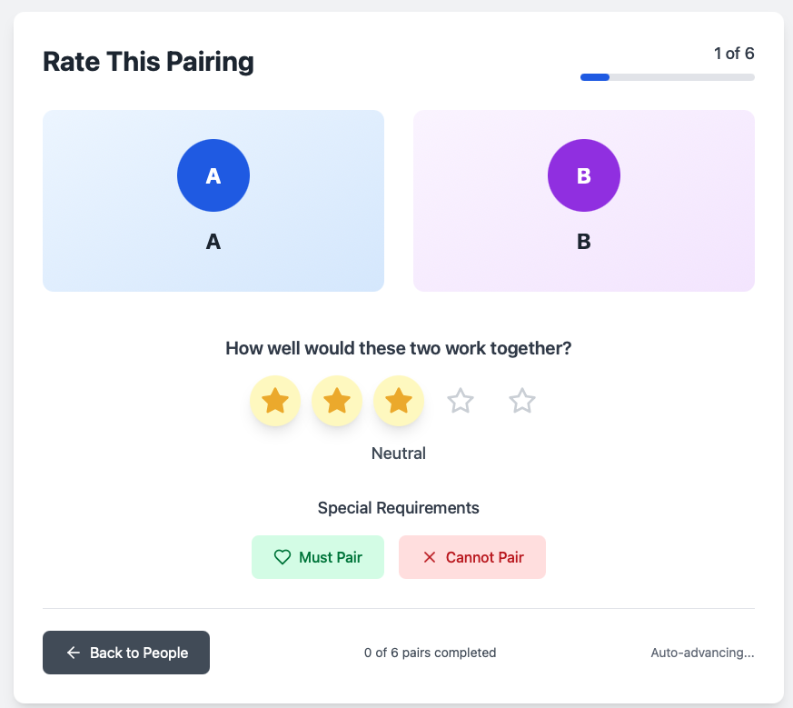
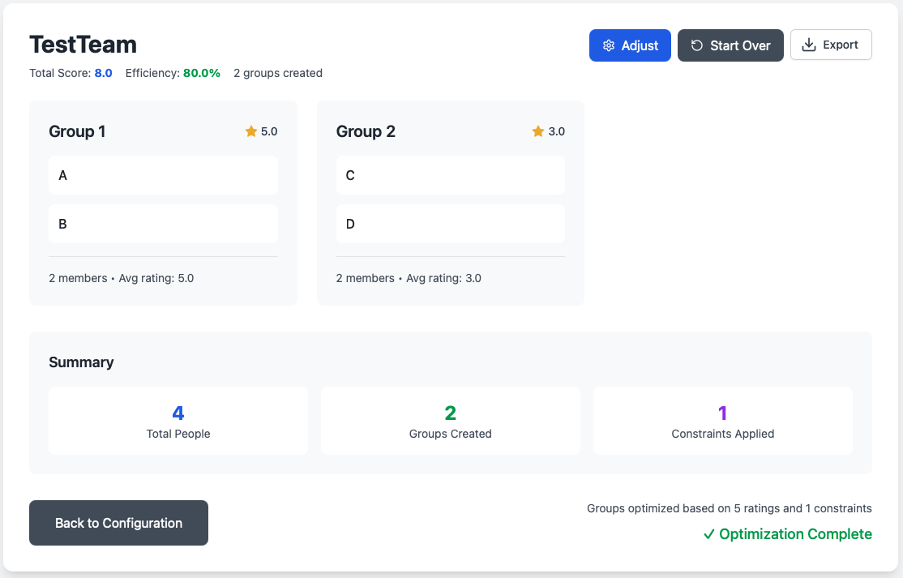

# GroupMatcher 

A web app for determining optimal groupings for things like sports teams and wedding table assignments. 

Built with bolt.new and Gemini CLI

A live version of this app can be found at: https://iridescent-conkies-0c7fec.netlify.app/

### Overview

After manually inputting all names either through manual entry or CSV upload each pair of people will be scored 1-5 based on compatibility. If two people must be paired or must not be paired that can be specified. 



Once all rating pairs are submitted the groupings that maximize overall compatibility subject to the provided constraints are determined 



### Running

#### Prereqs
Install `node` and `vite`. On Mac this can be accomplished with 
```
brew install node vite
```

### Run locally 
Install dependencies and buld the app.
```
npm install
npm run build
```

Run the app locally
```
npm run preview
```

Navigate to http://localhost:4173 to interact with the app.